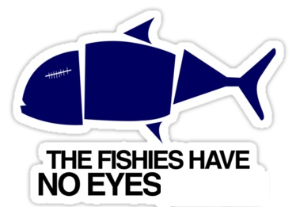
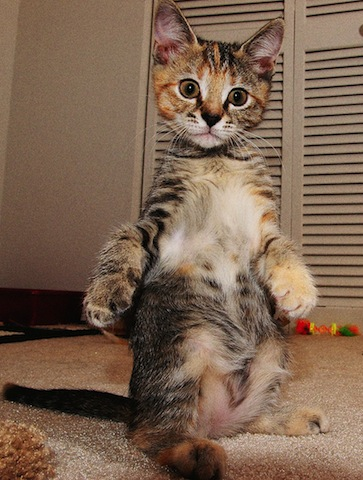

# Markdown

## The fishies (aka HTML)
- You open a tag `<tag>`
- You close a tag `</tag>`
- That simple

    

## Lazy peoples
- Fishies are hard to type (I guess)
- Hashtags are easier
- Lazy Gruber

## Switch fishies for hashtags
- Heading 1
    - In HTML: `<h1>Life is good</h1>`
    - In Markdown `# Life is good`

## More headings
- Heading 2: `## Life is sweet`
- Heading 3: `### Life is not so sweet`

## More stuff
- `*Italics*` means *emphasis*
- `**Bold**` means **strong**
- Unordered lists
    - Just use a `-`, as in `- milk` and `- bread`
- Ordered lists
    - Just put a number *(any number!)*, as in `1. wake up` and `2. shower`

## Links and images
- `I love my  [Uncle Google](http://google.com/ "Google")` creates
    - [Uncle Google](http://google.com/ "Google")
- `` creates
    - 

## Tutorial
- [Learn Markdown](http://commonmark.org/help/)

## Exercise
- Mark *down* the [following text](asparagus.txt)
- Submit your .md and .html files on the Canvas discussion board for Markdown experiments.
